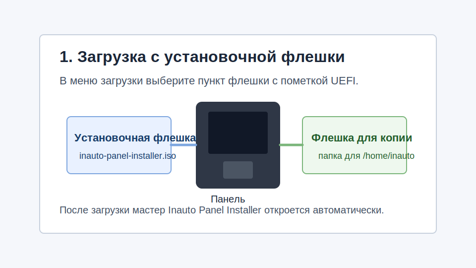
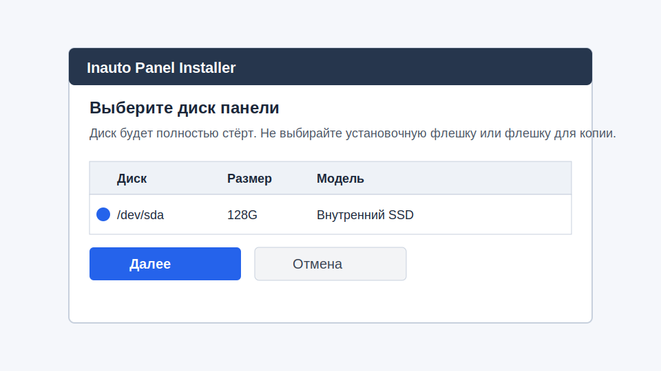
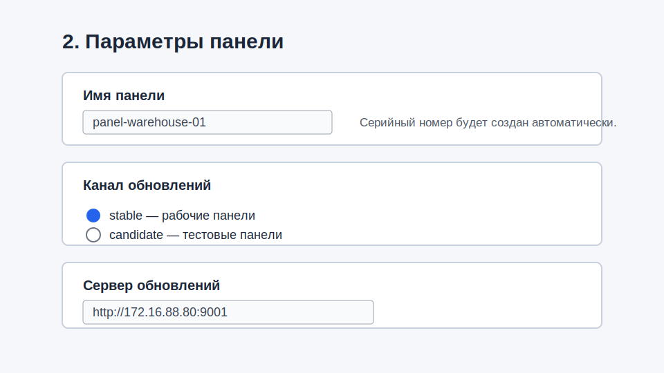
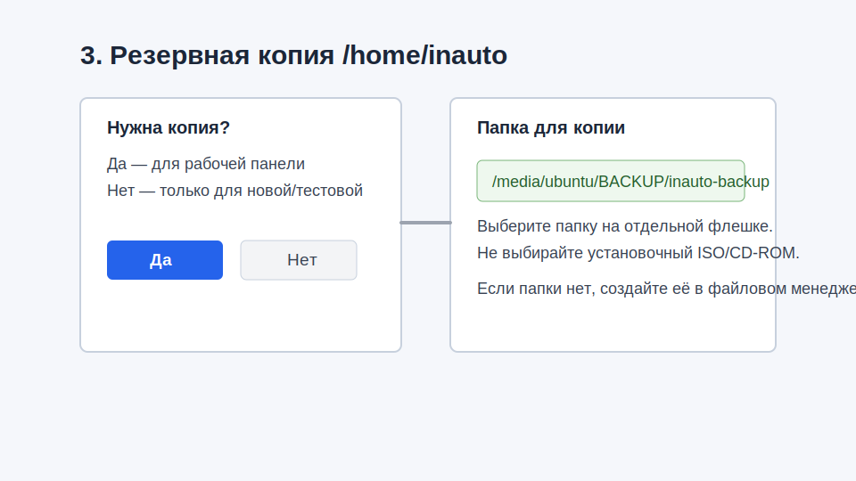
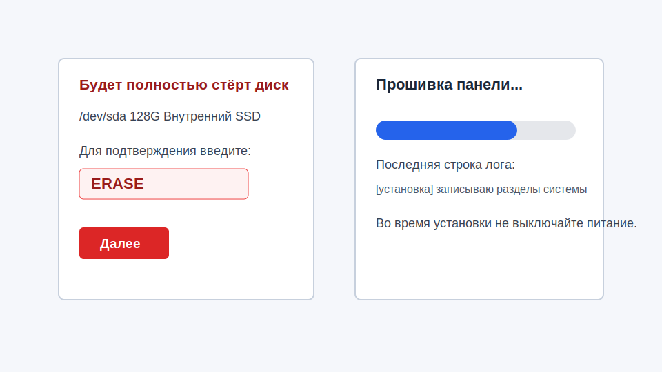
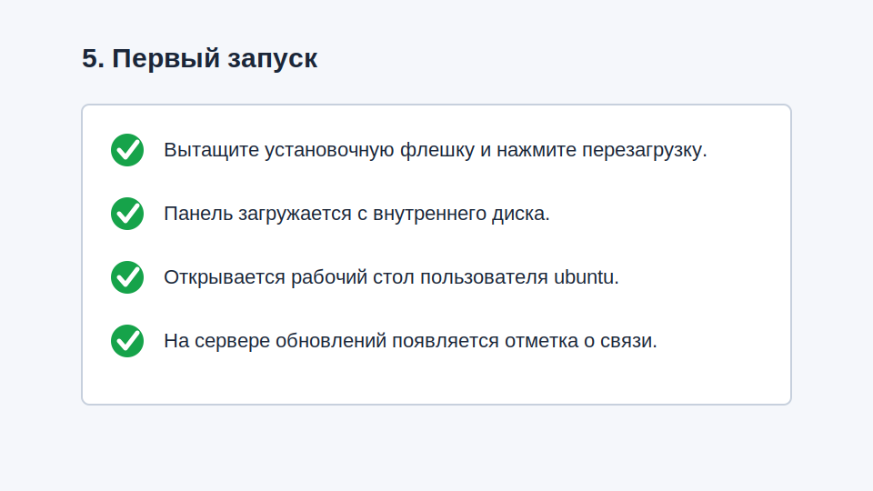

# Инструкция оператора: установка панели через ISO-образ

Применимость: установка или миграция панели через загрузочный диск
`inauto-panel-installer-*.iso`.

## Что подготовить

- Флешка с установочным ISO-образом.
- Отдельная флешка для резервной копии старого `/home/inauto`, если
  панель уже работала в эксплуатации.
- Имя панели, например `panel-warehouse-01`.
- Канал обновлений: обычно `stable`, для тестовых панелей `candidate`.
- Адрес сервера обновлений, например `http://172.16.88.80:9001`.



## 1. Загрузить панель с установочной флешки

1. Вставьте установочную флешку в панель.
2. Если нужна резервная копия, вставьте вторую флешку.
3. Включите панель и откройте меню загрузки.
4. Выберите пункт флешки с пометкой `UEFI`.
5. Дождитесь рабочего стола установочной среды.

Мастер `Inauto Panel Installer` должен открыться автоматически. Если он не
открылся, запустите ярлык `Inauto Panel Installer` на рабочем столе.

## 2. Выбрать внутренний диск панели



В окне выбора диска выберите внутренний SSD/eMMC панели. Диск будет полностью
стёрт.

Не выбирайте:

- установочную флешку;
- флешку для резервной копии;
- внешний диск инженера.

Если в списке несколько похожих дисков, остановитесь и уточните у инженера.

## 3. Ввести параметры панели



Введите имя панели. Разрешены латинские буквы, цифры, точка, подчёркивание
и дефис. Имя должно начинаться с буквы или цифры.

Выберите канал обновлений:

- `stable` — обычная рабочая панель;
- `candidate` — тестовая панель или проверка новой версии.

Введите адрес сервера обновлений полностью, вместе с `http://` или `https://`.

Пример:

```text
http://172.16.88.80:9001
```

## 4. Настроить резервную копию старого `/home/inauto`



Когда мастер спросит, нужно ли сохранить старый `/home/inauto`:

- выберите **Да**, если панель уже была в эксплуатации;
- выберите **Нет** только для новой или тестовой панели, где старые данные не нужны.

Если выбрано сохранение резервной копии:

1. Выберите папку на отдельной флешке для резервной копии.
2. Не выбирайте установочный ISO-образ или установочный носитель.
3. Если папки нет, создайте её в файловом менеджере, например
   `inauto-backup`.

По умолчанию мастер предлагает `/tmp/inauto-backup`. Это временная папка в
оперативной памяти: она подходит только для небольшой резервной копии и
исчезнет после перезагрузки.
Для рабочей панели лучше выбрать внешнюю флешку.

## 5. Подтвердить установку



Перед записью мастер покажет выбранный диск и попросит ввести:

```text
ERASE
```

Проверьте диск ещё раз. После ввода `ERASE` данные на выбранном диске будут
удалены.

Во время установки:

- не выключайте питание;
- не вынимайте установочную флешку;
- не вынимайте флешку с резервной копией до завершения установки.

Мастер покажет ход установки и журнал последнего действия.

## 6. Перезагрузить панель

Когда мастер покажет успешное завершение:

1. Согласитесь на перезагрузку.
2. Сразу после выключения экрана вытащите установочную флешку.
3. Флешку с резервной копией можно вытащить после завершения установки или
   после перезагрузки, если она уже не нужна на панели.



После перезагрузки панель должна загрузиться с внутреннего диска и открыть
рабочий стол пользователя `ubuntu`.

## 7. Быстрая проверка

Проверьте:

- панель загрузилась без установочной флешки;
- рабочий стол открылся;
- имя панели соответствует введённому имени;
- если была резервная копия, рабочие файлы появились в `/home/inauto`;
- на сервере обновлений появилась отметка о связи с серийным номером панели.

Если панель снова загрузилась в установщик, выключите её, вытащите установочную
флешку и включите снова.

## Когда остановиться и задать вопрос?

- В списке дисков непонятно, какой диск внутренний.
- Мастер пишет, что система загружена не в режиме UEFI.
- Установка завершилась ошибкой.
- После перезагрузки панель не загружается с внутреннего диска.

Сообщите поддержке текст ошибки и передайте файл журнала, который показывается мастер.